# Configuring Your Windows 10 Workstation to Properly Display Indigenous Language Characters

# Contents

[Introduction](#introduction) 
[Check that the BC Sans Font is Installed](#check-that-the-bc-sans-font-is-installed) 
[If Necessary, Install the BC Sans Font](#if-necessary-install-the-bc-sans-font) 
[Configure Office 365 Applications](#configure-office-365-applications) 
[Microsoft Word](#microsoft-word) 
[Microsoft Excel](#microsoft-excel) 
[Microsoft PowerPoint](#microsoft-powerpoint) 
[Microsoft Teams](#microsoft-teams) 
[Microsoft Access](#microsoft-access) 
[Configure Web Browsers](#configure-web-browsers) 
[Microsoft Edge](#edge) 
[Chrome](#chrome) 
[Firefox](#firefox)

# Introduction

This document is a guide to making sure that your Windows 10 workstation can properly display Indigenous language characters. It provides instructions for configuring common applications to use [BC Sans](https://www2.gov.bc.ca/gov/content?id=D56201B17F554B40BAB5A16FD2AB4C12) as the default font.

# Check that the BC Sans Font is Installed

As stated on the [BC Sans](https://www2.gov.bc.ca/gov/content?id=D56201B17F554B40BAB5A16FD2AB4C12) website,

_BC Sans (2.0) is an open-source "living" typeface developed for government to improve the readability and delivery of digital services. It was designed to support special characters and syllabics found in Indigenous Languages in B.C._

_BC Sans is required for use on all new and current government webpages on [gov.bc.ca](https://gov.bc.ca/), as well as government services hosted outside of gov.bc.ca._

If you are using a B.C. Government computer, then the BC Sans font is likely already installed on your computer, as the government systems regular update process will have installed it. However, it is easy to check to make sure that the font is installed. On a Windows 10 computer,

1. Type "Font settings" in the Windows search bar (which is normally located to the left on the taskbar at the bottom of the screen).
2. A Fonts settings page will appear. In the Available fonts search box, type "BC Sans"
3. If you see a result like the following:

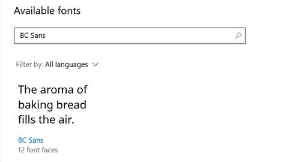

then BC Sans is installed. You can double click on "BC Sans" (blue text) to see more information about the font, such as the version that's installed, the font faces that are included (e.g., Regular, Bold, Bold Italic, etc.), and a preview of each font face at various sizes.

If nothing appears when you do the search, then BC Sans is not installed.

# If Necessary, Install the BC Sans Font

Instructions on downloading and installing the BC Sans Font on your computer can be found [here](https://www2.gov.bc.ca/gov/content?id=D56201B17F554B40BAB5A16FD2AB4C12).

# Configure Office 365 Applications

## Microsoft Word

To change the default font to BC Sans for most style types:

1. Open a new Word document.
2. Click the Design menu item

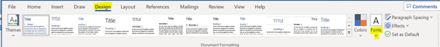

3. Click the arrow under **Fonts** , as shown in the illustration above.
4. Click on **Customize Fonts** , at the bottom on the pop-up panel that appears.
5. Enter BC Sans for both the **body Body** and **heading Heading** fonts and click **Save**.

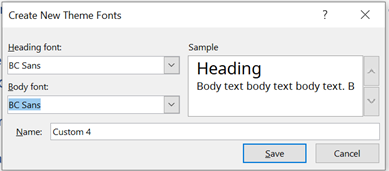

6. Click Set as Default

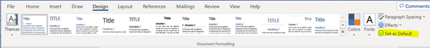

## Microsoft Excel

To change the default font for Excel sheets:

1. Open an Excel document.
2. Click **File** \> **Options.**
3. On the pop-up, select **General** on the left side.
4. On the right side, under " **When creating new workbooks**", select BC Sans as the default font and click OK.

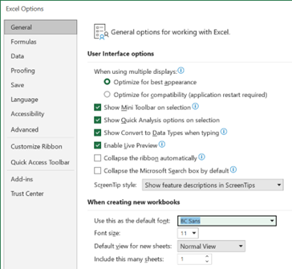

5. Exit Excel and restart it to continue work.

## Microsoft PowerPoint

To change the default font for PowerPoint presentations:

1. Open a PowerPoint presentation.
2. Select " **Slide Master**" on the menu bar.
3. Select **Fonts** and then **Customize Fonts …** on the dropdown menu that appears.

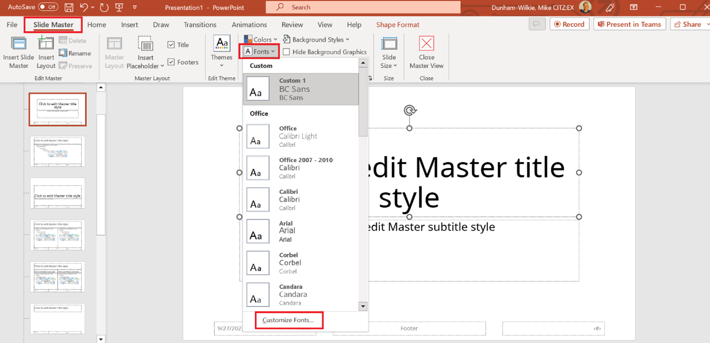

4. Create a BC Sans Font theme by specifying a **Heading** and **Body** font as shown below:

1. Click **Save**.
2. When creating PowerPoint presentations in the future, this theme will be selectable in the Slide Master (and be used as the default for other slides in the presentation)

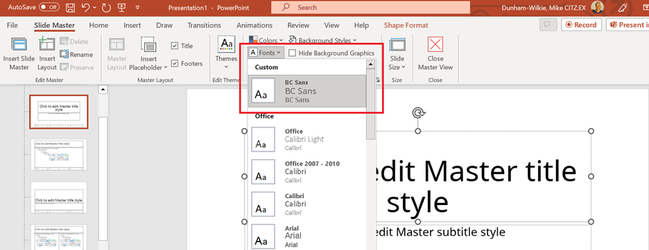

## Microsoft Teams

The Microsoft Teams application has built-in fonts and styles, and it does not appear that a BC Government user can alter these. However, the fonts used do support Unicode (and Indigenous languages), although the appearance of certain characters may not be exactly what they would be had BC Sans been used.

## Microsoft Access

Starting with Office 2000, Microsoft uses Unicode, encoded as UTF-8, for text fields, so it can store Indigenous language text without any further customization. However, like other Microsoft products, Microsoft Access uses Calibri as the default font. To change the default font for the forms and table content listings used for an Access database, follow these instructions:

1. Open the existing database (.accdb file) or a new one.
2. On the **Create** menu, select **Form Design** in the **Forms** section.
3. In the resulting window, select the **Form Design** menu, click on **Fonts** , and then on **Customize Fonts**.

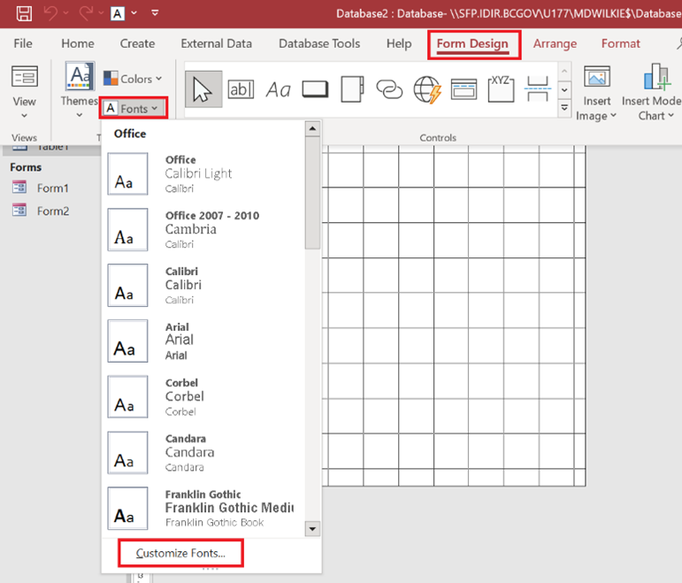

1. Create a BC Sans font theme by filling in the panel as shown below and pressing **Save** :

3. Click on **Fonts** again. The BC Sans item should now appear in the list. Right click on this item and select **Add Gallery to Quick Access Toolbar**.
4. When working on a different Access database in the future, click on the " **A**" as shown below, and select the BC Sans theme. This will establish BC Sans as the default font for that database.

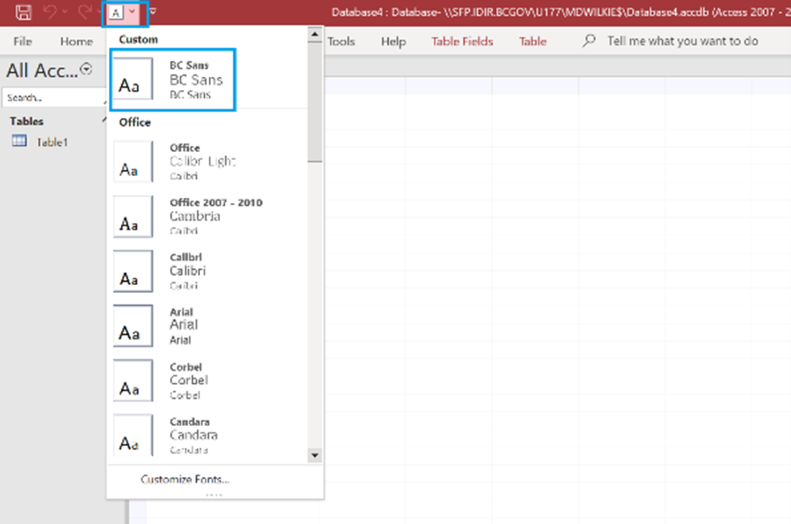

# Configure Web Browsers

## Microsoft Edge

1. Press Alt-F and then select **Settings** from the drop-down menu.
2. Click on **Appearance** on the left side and then scroll down to click on **Customize fonts** on the right, under the **Fonts** section.
3. Select BC Sans as both the Standard font and the Sans-serif font. These settings will be in effect for the current and future sessions.

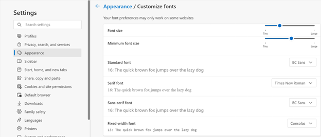

## Chrome

1. Press Alt-F and then select **Settings** from the drop-down menu.
2. Click on Appearance on the left side and then click on Customize fonts on the right.
3. Select BC Sans as the Standard font and the Sans-serif font. These settings will be in effect for the current and future sessions.

## Firefox

1. Press Alt-F to display the menu bar.
2. On the menu bar, select Tools \> Settings.
3. Click on General on the left, then scroll down to Fonts on the right.
4. Click Advanced… and then choose "Sans Serif" for Proportional and BC Sans for Sans-serif.

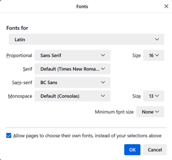

5. Click OK.