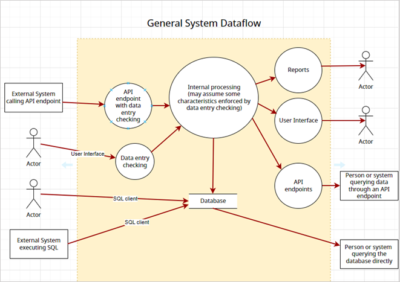
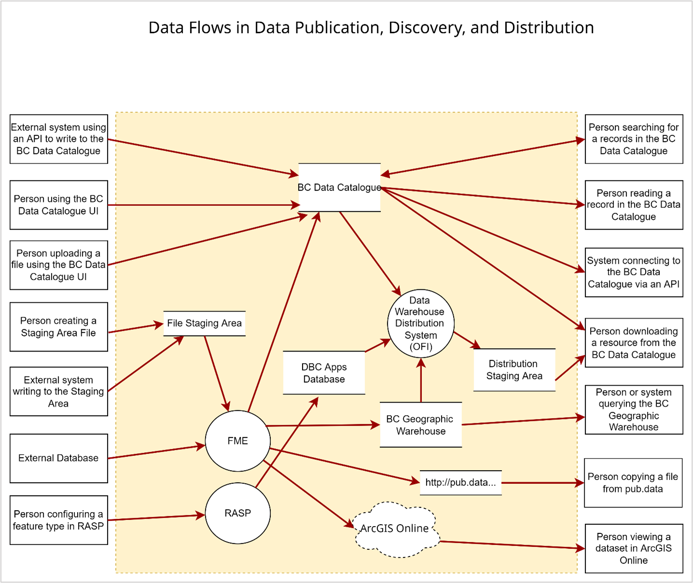

# Data Flow Evaluation
## Introduction to Data Flow Analysis - A Summary

One way to assess Unicode-Readiness is to investigate how a string that contains Unicode characters is processed by the system. Consider a simple system that inputs a name, stores it in a database, does a query on the name to find related information, and then outputs this related information. Such a system can be tested by inputting a name containing Unicode characters and checking that the output is as expected, and that no errors are generated.

The methodology of data flow analysis is described in the following sections, and an example of how it was used to analyze some systems managed by the BC Data Service Data Systems and Services branch is provided.

The methodology can be summarized as:

1. Enumerate all the ways data can enter a system (from another system, an API, user input, etc.)
2. Enumerate all the ways data can leave a system (through output to the screen, generation of error messages, an API, etc.)
3. Enumerate all the ways data can be stored in a system (in a file, in a database table, etc.)
4. Enumerate all the paths between input and store, input and output, store and output, etc.
5. Test each path with data containing Indigenous language graphemes. Test data is available at [../test_data/Readme.md](../test_data/Readme.md).

## Data Flow Analysis - the Details

### Data Flow Diagrams

[Data flow diagrams](https://en.wikipedia.org/wiki/Data-flow_diagram) can be used to model the flow of data:

- into and out of the system,
- into and out of the processes within the system, and
- into data stores such as files and databases.

Since data flow diagrams model how data flows throughout a system, they can be particularly useful in assessing whether a system will properly handle specific types of data (e.g., Indigenous place names data).

For a typical system that inputs/outputs "place name" data, the data flow diagram might look like this:

The system might guard against invalid input being entered (the circles on the left), then do some processing on the accepted data; it may store the data in a query-able database and/or make the data available to consumers through an API (right side of diagram).

### Data Flow Components

[Data flow diagrams](https://en.wikipedia.org/wiki/Data-flow_diagram) have four types of objects:

- entities (users or processes feeding data into the system or extracting data from the system),
- internal processes,
- data stores, and
- data flows.

#### Entities (Actors)

These are the entities that input or output data to/from a system. In a data flow diagram these are indicated using a rectangle (for a process feeding or consuming data) or a stick person (for a person entering data or querying data). To assess Unicode-Readiness it's important to identify all the ways strings containing Unicode characters can enter the system and leave the system. With systems dealing with Unicode characters, it is important to check that output entities (PDF documents, screen outputs, printed reports, etc.) display the Unicode characters correctly.

#### Processes

A process is something that is done to a data element as it travels from where it was input to where it ends up (either by leaving the system or being stored in the system). In data flow diagrams, processes are represented by circles. To assess Unicode-Readiness it's important to identify all the processes that can operate on strings containing Unicode characters.

#### Data Stores

Data stores are the places where data gets stored within a system. These might be files in a file system or tables in a database. File stores are represented by parallel horizontal lines (a box with no sides).

#### Data Flows

Data flows connect entities with processes and data stores. They are represented by directed lines. In assessing Unicode-Readiness, each data flow needs to be tested.

# Appendix: Analysis of DataBC Systems

### What is the DataBC program?

The Ministry of Citizens' Services, BC Data Division runs the [DataBC Program](https://www2.gov.bc.ca/gov/content?id=5A896C5DD9554C13AE75FEACCECF6671) to "encourage and enable the strategic management and sharing of data across the government enterprise and with the public." The program is staffed by four agile teams within the Data Systems and Services Branch:

1. Data Publication Services (DPS)
2. Data Discovery Services (DDS)
3. Map Services (MAP)
4. Location Services (LOC)

### What are the DPS and DDS systems?

The Data Publication Services (DPS) team serves clients in BC Government departments and the broader public sector who wish to make data that's under their [custodianship](https://www2.gov.bc.ca/assets/gov/data/data-management/data_custodianship_guidelines_for_the_government_of_bc.pdf) available to a broader audience (e.g., other government departments and/or the public). 

The Data Discovery Service (DDS), on the other hand, serves the public in discovering, downloading, and using the data made available by DPS. 

The DPS team manages the [BC Geographic Warehouse](https://www2.gov.bc.ca/gov/content?id=18B291A12B4F42EA98169892F4B46D61) (an Oracle database) 

The DDS team manages the operation and content of the [BC Data Catalogue](https://www2.gov.bc.ca/gov/content?id=42230A1DCE4B442A8D72B7B11A53DA5F) (a [CKAN](https://ckan.org/) data management system). Together, they

- Provide data modeling and architecture advice to people publishing data
- Develop and apply standards for creating metadata in the BC Data Catalogue

### Data flow diagram for DPS/DDS

The DPS and DDS systems are interrelated.; DPS manages the publication of data and the creation of metadata; DDS manages the systems that make this data discoverable and downloadable. For that reason, it's simplest to consider the DPS and DDS data flows together. The following is a data flow diagram for the DPS and DDS systems:

### Evaluation questions and results

Once the boxes on the left and right (data sources and targets) have been defined, the next step is to create a test case for each path from left to right, including test data, and including how you will judge whether the transit was successful. It's also important to define what is in scope and what isn't. For example, it may be acceptable for a system to not be able to support Unicode characters in file names. On the other hand, it may be required that lookup keywords and tags be able to include Unicode characters. The following is the scope definition, evaluation tasks, the expected results, and the actual results for DPS and DDS systems.

#### Out of Scope

1. Oracle table, column, and role names
2. File system directory and file names
3. Shapefile column names

#### In Scope

1. Oracle table column values
2. Oracle table column and table comments
3. BC Data Catalogue text field values (including record and resource titles), except URL's. (In the testing it was found that, for example, Tk’emlúps te Secwe̓pemc was encoded as tk-eml-ps-te-secwe-pemc (i.e., non-Latin characters were replaced with dashes)
4. BC Data Catalogue search
5. BC Data Catalogue preview content (data store)
6. BC Data Catalogue preview content 's json schema (data store)
7. Data Store file types
    * Text file contents
    * CSV file contents
    * JSON
8. File Store file types
    * Excel file contents
    * PDF
    * Images
9. Data Distribution Service from BC Geographic Warehouse via the Order Fulfiller Interface (OFI)
    * CSV
    * FGDB
    * SHP
    * GeoJSON

#### BC Data Catalogue Test record

[https://dwelf.data.gov.bc.ca/dataset/91328f94-cc8c-44f1-8c5c-2612133362ee](https://dwelf.data.gov.bc.ca/dataset/91328f94-cc8c-44f1-8c5c-2612133362ee)

#### Other Resources Used for Testing

String value: Tk'emlúps te Secwe̓pemc

Contact email address: Tk'emlúps.Secwe̓pemc@gov.bc.ca

BC Data Catalogue tags: Tk'emlúps, Secwe̓pemc

CSV file: [\\data.bcgov\data\_staging\_ro\BCGW\administrative\_boundaries\Federal\_IRs\_nonspatial.csv](//data.bcgov/data_staging_ro/BCGW/administrative_boundaries/Federal_IRs_nonspatial.csv) (UTF-8 encoded)

XLSX file: [\\data.bcgov\data\_staging\_ro\BCGW\administrative\_boundaries\Federal\_IRs\_nonspatial.xlsx](//data.bcgov/data_staging_ro/BCGW/administrative_boundaries/Federal_IRs_nonspatial.xlsx)(UTF-8 encoded)

File geodatabase: [\\data.bcgov\data\_staging\_ro\BCGW\administrative\_boundaries\Federal\_IRs.gdb](\\data.bcgov\data\_staging\_ro\BCGW\administrative\_boundaries\Federal\_IRs.gdb)

BCGW Database table: WHSE\_ADMIN\_BOUNDARIES.ADM\_INDIAN\_RESERVES\_BANDS\_SP

Non-BCGW Database table: nrkdb03.bcgov /osdbprd.nrs.bcgov (APP\_FNP.ASSERTION\_BCGW\_SVW) (Proxy Oracle account to access the table is PROXY\_BCGW\_FNP)

### Tests and Expected Results

| Test # | Description of the Test | The Expected Result | The Actual Result |
| --- | --- | --- | --- |
| 1 | Using the BC Data Catalogue UI, create a record (package) with Unicode characters in the title, description, tags, contact email address, and purpose. | Add completes without error | Mostly good but get an error  when specifying a tag having Unicode characters. |
| 2 | Using the BC Data Catalogue UI, create a resource with Unicode characters in the resource description and supplemental information. | Add completes without error |
| 3 | Repeat 1 using the CKAN API | package\_create successful | 
| 4 | Repeat 2 using the CKAN API| resource\_create successful |
| 5 | Update the package in 1 using the UI | Update completes without error |
| 6 | Update the resource in 2 using the UI | Update completes without error |
| 7 | Update the package in 3 using the CKAN API| Update completes without error |
| 8 | Update the resource in 4 using the CKAN API| Update completes without error |
| 9 | Upload a UTF-8 encoded CSV file containing Unicode characters to the BC Data Catalogue file store | Upload completes without error |
| 10 | Download the file uploaded in test 9 | Download successful and Unicode characters are preserved |  Note that CSV files must be encoded as UTF-8-BOM (not just UTF-8) to render correctly in Excel. (https://stackoverflow.com/questions/6002256/is-it-possible-to-force-excel-recognize-utf-8-csv-files-automatically). |
| 11 | Create CSV and XLSX files containing Unicode characters in the BC Geographic Warehouse File Staging Area | After saving the files and reopening them, the Unicode characters are preserved correctly |
| 12 | Using FME, read a file containing Unicode characters from the File Staging Area into the BC Geographic Warehouse. | Table loaded correctly (examine rows) |
| 13 | Using FME, load a BC Geographic Warehouse table from a table in a different database, containing Unicode characters. | Table loaded correctly (examine rows) |
| 14 | Configure the table created in 14 for download, by adding BC Data Catalogue resources | Resources added correctly |
| 15 | Use RASP to configure the short names and security for the table created in 14, entering Unicode characters into the display name and description | After closing and reopening RASP, fields entered previously appear correct | Could change a short name to 'MLúPS' but not 'LúPe̓' |
| 16 | Use the BC Data Catalogue search function to search for the package created in 1 using a string containing Unicode characters | Search should find the record |
| 17 | Use the BC Data Catalogue search function to search for the resource created in 2 using a string containing Unicode characters | Search should find the resource |
| 18 | Using the BC Data Catalogue UI, examine the fields in the resource created in 2 | The text appearing in the fields should appear to be correct |
| 19 | Using the CKAN API, call package_show, package_search, resource_show, resource_search, datastore_search| JSON returned by the calls should properly show the Unicode characters|  All good, except in the BC Data Catalogue user interface, the Preview shows the KAMLOOPS band names correctly: Tk’emlúps te Secwe̓pemc. However, the datastore_search API call returns JSON with the band name appearing a bit different: Tk’emlúps te Secwe̓pemc
| 20 | Using the BC Data Catalogue UI (OFI), download the table created in 14, as a shapefile, a file geodatabase, and a csv file | Download should be successful, and the download products should preserve the Unicode characters correctly |   Cannot test short names with Unicode characters, since we don't have an appropriate test environment that combines all systems involved in data download. However, short names are used just for shapefile column names, and shapefile column names are out of scope. |
| 21 | Query the BC Geographic Warehouse, searching for the table with Unicode characters created in 13 or 14 (using the Unicode characters in the "like" clause)| Query should find the text | 
| 22 | Examine the dataset ADM\_INDIAN\_RESERVES\_BANDS\_SP shown in ArcGIS Online Map Viewer ([https://governmentofbc.maps.arcgis.com](https://governmentofbc.maps.arcgis.com/)[/apps/mapviewer/index.html?](https://governmentofbc.maps.arcgis.com/)[layers=eacb5780fce3411791278b2fa31d6f07](https://governmentofbc.maps.arcgis.com/)) | Band name Tk'emlúps te Secwe̓pemc should display correctly | 