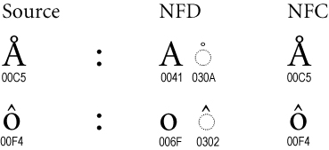
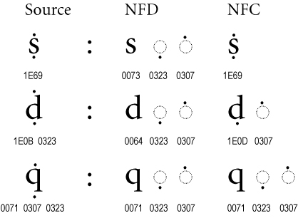

# Introduction

A particular symbol, aka grapheme, may be represented by Unicode characters in different ways. For example, the grapheme “é” may be represented by a [single Unicode character](https://www.compart.com/en/unicode/U+00E9) or by a combination of two Unicode characters: ["e"](https://www.compart.com/en/unicode/U+0065) combined with an [acute accent](https://www.compart.com/en/unicode/U+0301), This calls for the need for a way of representing symbols as Unicode characters consistently; this process is called [Normalization](https://unicode.org/reports/tr15/), and the preceding link provides extensive information on the process, excerpts of which are repeated below.

# Canonical vs Compatible Equivalence
The Unicode Standard defines two formal types of equivalence between characters: canonical equivalence and compatibility equivalence. Canonical equivalence is a fundamental equivalency between characters or sequences of characters which represent the same abstract character, and which when correctly displayed should always have the same visual appearance and behavior. For example, the grapheme “é” may be represented by a [single Unicode character](https://www.compart.com/en/unicode/U+00E9) or by a combination of two Unicode characters: ["e"](https://www.compart.com/en/unicode/U+0065) combined with an [acute accent](https://www.compart.com/en/unicode/U+0301). These two representations are canonically equivalent.

Compatibility equivalence is a weaker type of equivalence between characters or sequences of characters which represent the same abstract character (or sequence of abstract characters), but which may have distinct visual appearances or behaviors. The visual appearances of the compatibility equivalent forms typically constitute a subset of the expected range of visual appearances of the character (or sequence of characters) they are equivalent to. An example of a pair of compatibility equivalent graphemes are the latin small letter ["w"](https://www.compart.com/en/unicode/U+0077) and the Indigenous language character ["ʷ"](https://www.compart.com/en/unicode/U+02B7), as used in "Lək̓ʷəŋən".

# Normalization Forms
Unicode Normalization Forms are formally defined normalizations of Unicode strings which make it possible to determine whether any two Unicode strings are equivalent to each other. Depending on the particular Unicode Normalization Form, that equivalence can either be a canonical equivalence or a compatibility equivalence.

Essentially, the Unicode Normalization Algorithm puts all combining marks in a specified order, and uses rules for decomposition and composition to transform each string into one of the Unicode Normalization Forms. A binary comparison of the transformed strings will then determine equivalence.

We will not consider Normalization Forms based on compatibility equivalence, since that form doesn't necessary preserve the appearance of graphemes (an important feature for representing Indigenous languages).

There are two Normalization Forms based on canonical equivalence:

| Form | Description |
| --- | --- |
|Normalization Form D (NFD)|Canonical Decomposition|
|Normalization Form C (NFC)|Canonical Decomposition, followed by Canonical Composition|

NFD decomposes a grapheme into its constituent parts, while NFC combines constituent parts into a single Unicode character, if one exists.

Some graphemes are have more than 2 constituent parts, so when decomposing these it's important to order the constituent parts consistently. Otherwise, identically looking graphemes, ordered differently, will not match. The following table illustrates this.

## Program Example of Normalization

The Python 3 program [utf8.py](../../programming_languages/python3/utf8.py) uses the [unicodedata](https://www.askpython.com/python-modules/unicode-in-python-unicodedata) library to compute both the NFC and NFD of a list of input strings.