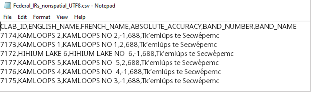
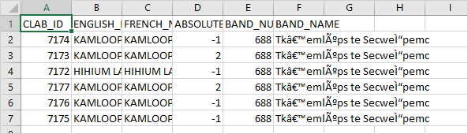
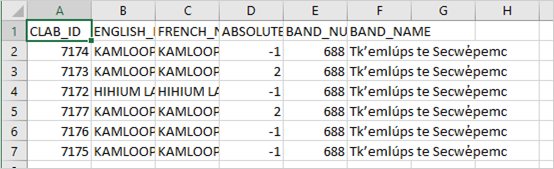

# Opening CSV files in Excel
Comma-separated value (CSV) Excel files will not render properly when opened in Excel if they do not include a byte order mark (BOM) at the start of the file. The following example illustrates the problem.
### Rendering of UTF-8 CSV file in Notepad
In Notepad, the Unicode values in the right-most column (BAND-NAME) appear to render correctly:


 
### Rendering of UTF-8 CSV file in Excel
However, when the file is opened in Excel, the rendering is erroneous:



To correct this error, either of the following snippets of python 3 code can be applied to the input file (or incorporated into any program that creates CSV files to be later opened in Excel).

```
Utfbomfile = open(‘Federal_Irs_nonspatial_UTF8_BOM_1.csv’,’w’)
# Write BOM characters
utfbomfile.write(chr(0xEF) + chr(0xBB) + chr(0xBF))
# Copy the rest of the file
with open(‘Federal_Irs_nonspatial_UTF8.csv’,’r’) as utffile:
    line = utffile.readline() 
    while line != ‘’:
        utfbomfile.write(line)
        line = utffile.readline()
utfbomfile.close()
utffile.close()
```
or

```
utfbomfile = open(‘Federal_Irs_nonspatial_UTF8_BOM_2.csv’,’w’,encoding=’utf-8-sig’)
# Copy the file
with open(‘Federal_Irs_nonspatial_UTF8.csv’,’r’,encoding=’utf-8’) as utffile:
    line = utffile.readline() 
    while line != ‘’:
        utfbomfile.write(line)
        line = utffile.readline()
utfbomfile.close()
utffile.close()
```

Once applied, the resulting file opens correctly in Excel:
 

