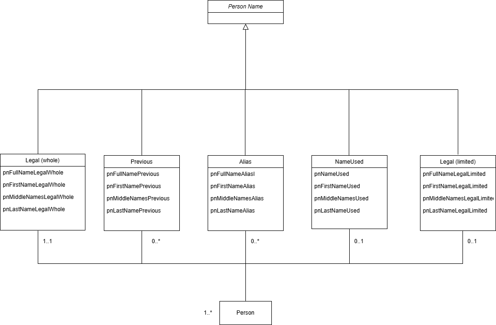

# Person Name Data Standard

The Person Name Data Standard provides technical specifications on how to input, store, and display people’s names accurately and respectfully while considering the technology required for effective information exchange and usage. 

This directory contains tools that may be useful in implementing the Standard.

## PersonName Schema
The following [Unified Modeling Language (UML)](https://en.wikipedia.org/wiki/Unified_Modeling_Language) diagram illustrates the structure of a PersonName, and its relationship to a person:



The diagram shows the five types of PersonName and the associated attributes of each. Any of these names can be shared by many persons (denoted by the “1..*” above the person box). In the other direction, an individual person has:
* Exactly one current (whole)legal name (“1..1”)
* Zero or one alternate spellings (limited legal) (“0..1”)
* Zero or more previous names (“0..*”)
* Zero or more aliases (“0..*”)
* Zero or one NameUsed names (“0..1”)

JSON Schemas provide a way of documenting the structure and constraints of data types, such as “PersonName”. Given a PersonName instance provided as JSON text, the JSON Schema for PersonName can be used to validate that instance. 

A JSON Schema for PersonName can be found [here](https://github.com/bcgov/inclusive-names-service/blob/main/docs/person_name_data_standard/person_name.json). 
Also provided are four sample PersonName JSON data files: [person_name_examples](https://github.com/bcgov/inclusive-names-service/blob/main/docs/person_name_data_standard/person_name_examples)
There are utilities available for validating a JSON data file against a JSON Schema file. On such utility can be found [here](https://www.jsonschemavalidator.net/).

## Person Name Splitting 
The Standard suggests, when practical, to provide and report person names in a single field, rather than splitting it into First/Middle/Last Name parts. There are, however, instances where person names may need to be split into parts in order to exchange data with legacy systems. In those cases, code such as the following can be used to do the splitting.

```

POLYNYM_PREFIXES = {
    "van", "von", "der", "de", "da", "di", "la", "le",
    "bin", "ibn", "al", "el"
}


def split_person_name(full_name: str):
    """
    Splits a full name according to rules aligned with the
    Person Name Data Standard.

    Behaviour:
     - Mononyms are placed in Last Name; First Name gets '.' if required.
    - Polynym-aware splitting for multi-word names.
    """

    full_name = full_name.strip()

    if not full_name:
        return "", "", ""

    parts = full_name.split()

    # Mononym case
    if len(parts) == 1:
        mononym = parts[0]

        # For systems that require First + Last:
        first = "."
        last = mononym
        return first, "", last

    # Two parts → first and last
    if len(parts) == 2:
        return parts[0], "", parts[1]

    # Polynym-aware splitting 
    last_parts = [parts[-1]]
    
    i = len(parts) - 2

    while i >= 0 and parts[i].lower() in POLYNYM_PREFIXES:
        last_parts.insert(0, parts[i])
        i -= 1

    first = parts[0]
    middle = " ".join(parts[1:i+1]) if i >= 1 else ""
    last = " ".join(last_parts)

    return first, middle, last
    
print(split_person_name('Sandra Lee Lenius'))
print(split_person_name('Ollie van der Heide'))
print(split_person_name('stáʔləw George'))
print(split_person_name('Mike'))
```

When run, the program will produce the following output:

('Sandra', 'Lee', 'Lenius')

('Ollie', '', 'van der Heide')

('stáʔləw', '', 'George')

('.', '', 'Mike')

## Person Name Forms Examples
The following examples illustrate how to apply the Person Name Data Standard when building forms to input or display person names.
### Legal (Whole) and Legal (Limited)
This form illustrates the difference between two versions of a legal name - the *Whole* version (Unicode) and the *Limited* version (ASCII). It follows the recommendation in the Person Name Data Standard:
>Many users won’t have a Legal (whole) name, the user interface should indicate that entry of data into this field should be optional.

In this form, when a Legal (whole) full name is entered, code is run to split the full name into first/middle/last name component fields, using the any-ascii algorithm to produce an approximate ASCII-only version of the fields. After the fields are populated by this code, they may be further edited manually. Note that the first, middle, and last name field values are constrained as described in the text appearing below the fields.

https://submit.digital.gov.bc.ca/app/form/submit?f=f663f9ed-539e-4478-b0b5-9548bd10b224

[JSON](https://github.com/bcgov/inclusive-names-service/blob/main/docs/person_name_data_standard/chefs_forms/legal_whole_and_legal_limited_schema.json)
 

### Full Name and Name Used
The Person Name Data Standard states:
>If the name type is evident based on the context, or a low level of confidence is required, then the name type can be omitted.

This form illustrates how the name type is omitted for the _Full Name_ but specified for _Name Used_.

The Name Used can be specified with any of the following combinations of person name components:

1. First name/middle name/last name
2. Given name/last name
3. First name/last name
4. Given name
5. First name

Once the full name is entered, the name used components will be pre-populated and can then be overridden manually.

https://submit.digital.gov.bc.ca/app/form/submit?f=7764ecdf-7461-4e55-8ed6-0a950c03c982

[JSON](https://github.com/bcgov/inclusive-names-service/blob/main/docs/person_name_data_standard/chefs_forms/full_name_and_name_used_schema.json)


### Previous names and aliases
This form illustrates that the person may have one or more aliases and/or previous names. The form assumes that the name type for the first field (Full name) can be implied from the context and doesn't need to be specified. The remaining fields are used to supply 0 or more full names of types "alias" and "previous".

https://submit.digital.gov.bc.ca/app/form/submit?f=c496ad8a-cb8b-4d0c-8886-5f7962f6de04

[JSON](https://github.com/bcgov/inclusive-names-service/blob/main/docs/person_name_data_standard/chefs_forms/multiple_previous_names_aliases_schema.json)
