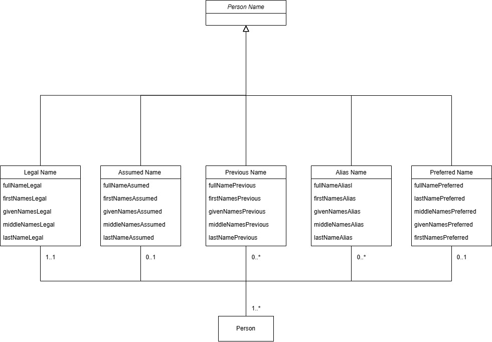

# PersonName Schema
The following [Unified Modeling Language (UML)](https://en.wikipedia.org/wiki/Unified_Modeling_Language) diagram illustrates the structure of a PersonName, and its relationship to a person:

The diagram shows the five types of PersonName and the associated attributes of each. Any of these names can be shared by many persons (denoted by the “1..*” above the person box). In the other direction, an individual person has:
* Exactly one legal name (“1..1”)
* Zero or one assumed names (“0..1”)
* Zero or more previous names (“0..*”)
* Zero or more aliases (“0..*”)
* Zero or one preferred names (“0..1”)

JSON Schemas provide a way of documenting the structure and constraints of data types, such as “PersonName”. Given a PersonName instance provided as JSON text, the JSON Schema for PersonName can be used to validate that instance. 

A JSON Schema for PersonName can be found [here](https://github.com/bcgov/inclusive-names-service/blob/main/docs/schemas/person_name.json). 
Also provided are four sample PersonName JSON data files: [person_name_examples](https://github.com/bcgov/inclusive-names-service/blob/main/docs/schemas/person_name_examples)
There are utilities available for validating a JSON data file against a JSON Schema file. On such utility can be found [here](https://www.jsonschemavalidator.net/). 

