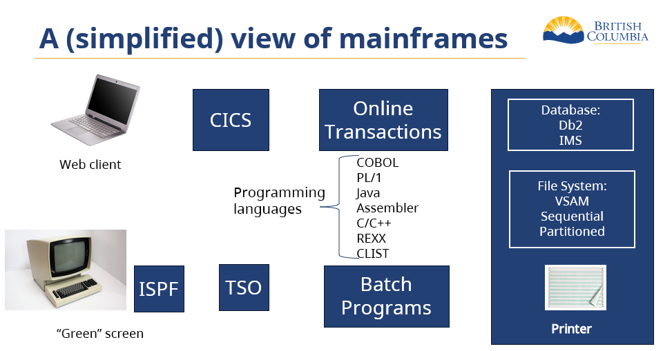

# Configuring IBM mainframe systems to support Indigenous language text 

The following diagram provides a simplified view of the IBM Mainframe architecture.  

The IBM Mainframe originally used, exclusively, the [Extended Binary Coded Decimal Interchange Code (EBCDIC)](https://en.wikipedia.org/wiki/EBCDIC) character set. Like [ASCII](https://en.wikipedia.org/wiki/ASCII), EBCDIC is a single-byte character set, although there are incomptibilities between the two. And as EBCDIC is limited to 256 characters, it is not suitable for expressing Indigenous language text.

## EBCDIC-only elements

Some elements in the picture above work only with EBCDIC - you can think of EBCDIC being "baked into" these elements. "Green screen" terminals are hard-wired to send and receive data in EBCDIC, and mainframe printers are hard-wired to interpret any data directed to them as being EBCDIC.

### EBCDIC

[The EBCDIC character set](https://www.ibm.com/docs/en/zos-basic-skills?topic=mainframe-ebcdic-character-set)  

### 'Green Screen' Applications
See [Green screen applications and Unicode data](https://www.ibm.com/docs/en/db2-for-zos/13?topic=ccsids-green-screen-applications-unicode-data)  

## Unicode-configurable elements

The elements at the top of the picture - CICS, the programming languages, and mainframe databases and files - are all capable of being configured to process data encoded as Unicode/UTF-8. The following sections provide links.

### Files

[Storing and Viewing Unicode Data](https://www.ibm.com/support/pages/storing-and-viewing-unicode-data)  
[Processing Unicode Complex Text](https://www.ibm.com/docs/en/zos/3.1.0?topic=examples-processing-unicode-complex-text)  
[Using extended code pages](https://www.ibm.com/docs/en/zos/3.1.0?topic=examples-using-extended-code-pages)  
[Working with UTF-8 data](https://www.ibm.com/docs/en/zos/3.1.0?topic=data-working-utf-8)  

### CICS (Application / Web Server)
See [Unicode data](https://www.ibm.com/docs/en/cics-ts/6.1?topic=conversions-unicode-data)

### Programming Languages
See the following links:

[Application programming with Unicode data and multiple CCSIDs](https://www.ibm.com/docs/en/db2-for-zos/13?topic=data-application-programming-unicode-multiple-ccsids)  
### IMS Database
See the following links:

* [Specifying data types for application programs](https://www.ibm.com/docs/en/ims/15.4.0?topic=utilities-specifying-data-types-application-programs)  
* [DFSMARSH statements](https://www.ibm.com/docs/en/ims/15.4.0?topic=statements-dfsmarsh)  
* [CREATE TABLE](https://www.ibm.com/docs/en/ims/15.4.0?topic=statements-create-table)

### Db2 Database
See [Unicode Support in Db2](../databases/db2/db2.md)