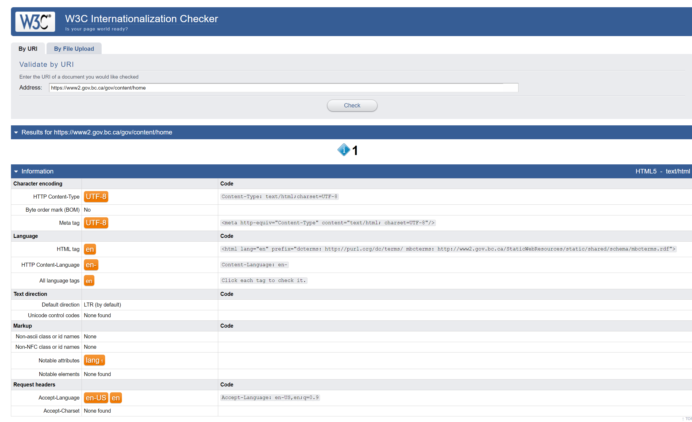
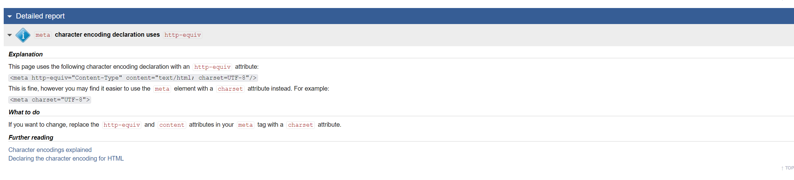

Web servers can be configured to serve web pages that have Unicode content. In Apache web servers, this configuration can be done by adding the line

         ‘AddDefaultCharset utf-8’

to the httpd.conf configuration file.

When configured this way, a page with the following html will appear, correctly, as Tk’emlúps te Secwe̓pemc

         <html><body>
         <h1>Tk’emlúps te Secwe̓pemc </h1>
         </body></html>

If that line is missing from the configuration file, then the same page might appear like Tk’emlúps te Secwe̓pemc

Regardless of how the web server is configured, Unicode support can be ensured by including a directive in the web page itself. For example, the following page will render properly even if the web server has not been configured for Unicode support, since the web page includes a meta charset directive:

         <html><body>
         <meta charset="UTF-8">
         <h1>Tk’emlúps te Secwe̓pemc </h1>
         </meta>
         </body></html>

Webpage URLs and individual HTML web pages can be checked for Unicode conformance using the free [W3C Internationalization Checker](https://validator.w3.org/i18n-checker/) tool.  Output of this tool for https://www.gov.bc.ca appears as the following:

## Additional Resources

[Internationalization techniques: Authoring web pages](https://www.w3.org/International/techniques/authoring-html)

[Declaring character encodings in HTML](https://www.w3.org/International/questions/qa-html-encoding-declarations)

This document covers the following topics:
1. What about the byte-order mark?
2. Should I declare the encoding in the HTTP header?
3. Working with polyglot and XML formats
4. Additional learning resources
